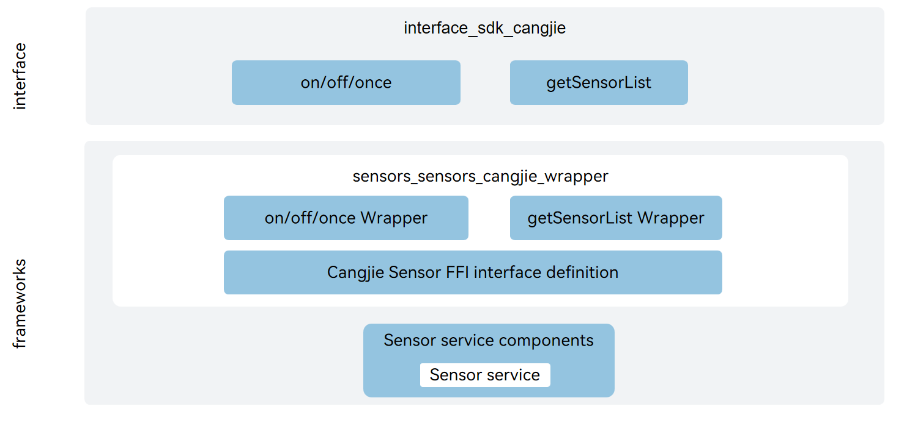

# Generic Sensor Service Cangjie Wrapper

## Introduction

The Generic Sensor Service Cangjie Wrapper provides sensor-related capabilities for developers using the Cangjie language for application development on OpenHarmony. The Generic Sensor Service Cangjie Wrapper  provides the ability to obtain sensor data, including getting sensor attribute lists, subscribing to sensor data. The current Generic Sensor Service Cangjie wrapper interface supports standard devices.
See [Sensor Type](https://gitcode.com/openharmony-sig/arkcompiler_cangjie_ark_interop/blob/master/doc/Dev_Guide/source_en/device/sensor/cj-sensor-overview.md) for details.

## System Architecture

**Figure 1** Generic Sensor Service Cangjie Architecture



As shown in the architecture diagram:

Interface Layer:

- The sensor function interface provides external capabilities for subscribing to sensor data, unsubscribing from sensor data, and obtaining sensor information on the device. The available sensors include accelerometer, temperature sensor, barometer, gravity sensor, gyroscope, heart rate sensor, humidity sensor, ambient light sensor, and pedometer, among others.
- Subscribe to sensor data: Allows developers to initiate subscription requests. After subscribing, they can receive real-time data pushes from the specified sensors.
- Unsubscribe from sensor data: Allows subscribed external systems to stop receiving data from a specified sensor. After unsubscribing, subsequent data pushes from that sensor will no longer be received.
- Ability to obtain sensor information on the device: includes obtaining information such as the sensor's name, hardware version, and accuracy.

Framework Layer:

- Sensor function encapsulation: This encapsulation layer implements a packaging of the capabilities to subscribe to sensor data, unsubscribe from sensor data, and obtain sensor information on the device.

Dependency Component Introduction in Architecture Diagram:

- sensor: Responsible for providing basic sensor functionality.
- cangjie_ark_interop: Responsible for providing Cangjie annotation class definitions for API annotation, and providing BusinessException exception class definitions thrown to users.
- hiviewdfx_cangjie_wrapper: Responsible for providing log interfaces for printing logs at critical paths.

## Directory

```
base/sensors/sensors_cangjie_wrapper   
├── figures               # Architecture diagrams in README
├── kit
│   └── SensorServiceKit  # SensorServiceKit code directory
├── ohos
│   └── sensor            # Sensor Cangjie interface code
└── test
    └── sensor            # Sensor Cangjie interface test case code
```

## Usage Instructions

As shown in the architecture diagram, the Generic Sensor Service Cangjie provides the following functions:

- Subscribe to Sensor, listen for Sensor data changes.
- Unsubscribe from Sensor.
- Get Sensor information on the device.

For sensor-related APIs, please refer to [Sensor API Reference](https://gitcode.com/openharmony-sig/arkcompiler_cangjie_ark_interop/blob/master/doc/API_Reference/source_en/apis/SensorServiceKit/cj-apis-sensor.md). For related guidance, please refer to [Sensor Development Guide](https://gitcode.com/openharmony-sig/arkcompiler_cangjie_ark_interop/blob/master/doc/Dev_Guide/source_en/device/sensor/cj-sensor-guidelines.md).

## Constraints

* To use Sensor functions, the device must have the corresponding Sensor components.
* For certain Sensors, developers need to request the corresponding permissions to obtain the respective Sensor data.
* Compared to APIs provided by ArkTS, the following capabilities are not currently supported:
  * Get geomagnetic field information at a specific location on Earth.
  * Get altitude based on pressure values.

## Contribution

Developers are welcome to contribute code, documentation, etc. For specific contribution processes and methods, please refer to [Contribution](https://gitcode.com/openharmony/docs/blob/master/en/contribute/how-to-contribute.md).

## Related Repositories

[sensors\_sensor](https://gitcode.com/openharmony/sensors_sensor/blob/master/README.md)

[cangjie_ark_interop](https://gitcode.com/openharmony-sig/arkcompiler_cangjie_ark_interop/blob/master/README.md)

[hiviewdfx_cangjie_wrapper](https://gitcode.com/openharmony-sig/hiviewdfx_hiviewdfx_cangjie_wrapper/blob/master/README.md)
