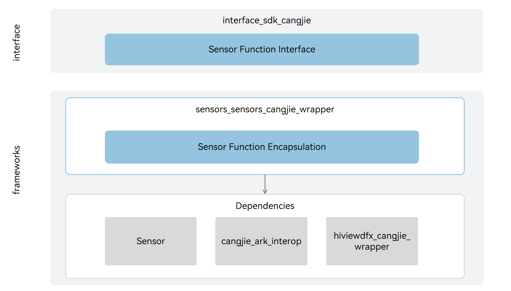

# sensors_cangjie_wrapper

## Introduction

The sensors_cangjie_wrapper is a Cangjie API encapsulated on OpenHarmony based on the capabilities of the pan-sensor service subsystem. The pan-sensor service subsystem provides a lightweight sensor service framework, through which you can perform the following operations:

-   Query the sensor list.
-   Enable or disable a sensor.
-   Subscribe to or unsubscribe from sensor data.
-   Set the data reporting mode of a sensor.

The following figure shows the architecture of the pan-sensor service framework.



## Directory Structure

```
base/sensors/sensors_cangjie_wrapper
├── ohos             # Cangjie Pan-Sensor code
├── kit              # Cangjie kit code
├── figures          # architecture pictures
```

## Constraints

The DFX Cangjie interface currently under development only supports standard devices.

## Usage

As shown in the diagram, Sensor Service Cangjie provides the following capabilities, and developers can use one or more types of interfaces according to their usage needs:

-   Sensor API: provides APIs for performing basic operations on sensors, including querying the sensor list and subscribing to or unsubscribing from sensor data.

Compared to ArkTS, the following features are currently not supported:

-   Sensor Framework: manages sensor data subscription, creates and destroys data channels, subscribes to or unsubscribes from sensor data, and implements communication with the Sensor Service module.
-   Sensor Service: interacts with the HDF module to receive, parse, and distribute data, manages sensor services and sensor data reporting, and controls sensor permissions.

Please refer to the Sensor related API for details[ohos.sensor(Sensors)](https://gitcode.com/openharmony-sig/arkcompiler_cangjie_ark_interop/blob/master/doc/API_Reference/source_en/apis/SensorServiceKit/cj-apis-sensor.md). For relevant guidance, please refer to[Introduction to Sensor Service Kit Development](https://gitcode.com/openharmony-sig/arkcompiler_cangjie_ark_interop/blob/master/doc/Dev_Guide/source_en/device/sensor/cj-sensor-overview.md)。

## Code Contribution

Developers are welcome to contribute code, documentation, etc. For specific contribution processes and methods, please refer to [Code Contribution](https://gitcode.com/openharmony/docs/blob/master/en/contribute/code-contribution.md).

## Repositories Involved

[sensors_miscdevice_lite](https://gitee.com/openharmony/sensors_sensor/blob/master/README.md)