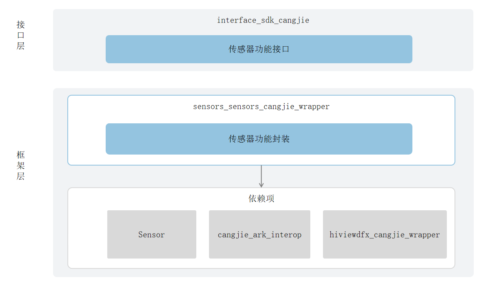

# 泛Sensor服务仓颉封装

## 简介

泛Sensor服务仓颉封装是 OpenHarmony 上面向开发者提供使用仓颉语言进行应用开发时的传感器相关能力。泛Sensor服务仓颉封装提供了获取传感器数据的能力，包括获取传感器属性列表、订阅传感器数据功能，且仅支持standard设备。

## 系统架构

**图 1**  泛Sensor服务仓颉封装架构图




接口层：

- 传感器功能接口对外提供了订阅传感器数据、取消订阅传感器数据和获取设备上的传感器信息的能力。能获取的传感器有加速度传感器、温度传感器、气压计传感器、重力传感器、陀螺仪传感器、心率传感器、湿度传感器、环境光传感器、计步传感器等。
- 订阅传感器数据：允许开发者发起订阅请求，订阅后可接收指定传感器的实时数据推送。
- 取消订阅传感器数据：允许已订阅的外部系统终止对指定传感器的数据接收，取消后不再获取该传感器的后续数据推送。
- 获取设备上的传感器信息的能力：获取的是传感器的名称、硬件版本、精度等信息。

框架层：

- 传感器功能封装：该封装层是对订阅传感器数据、取消订阅传感器数据和获取设备上的传感器信息的能力进行仓颉封装实现。

架构图中的依赖部件引入说明：

- Sensor：负责提供传感器基础功能。
- cangjie_ark_interop：负责提供仓颉注解类定义，用于对API进行标注，以及提供抛向用户的BusinessException异常类定义。
- hiviewdfx_cangjie_wrapper：负责提供日志接口，用于在关键路径处打印日志。

## 目录

```
base/sensors/sensors_cangjie_wrapper   
├── figures               # 存放README中的架构图
├── kit
│   └── SensorServiceKit  # SensorServiceKit代码目录
├── ohos
│   └── sensor            # sensor仓颉接口代码
└── test
    └── sensor            # sensor仓颉接口测试用例代码
```

## 使用说明

提供了以下传感器功能：

- 订阅传感器，监听传感器数据变化。
- 取消传感器订阅。
- 获取设备上的传感器信息。

传感器相关API请参见[传感器API参考](https://gitcode.com/openharmony-sig/arkcompiler_cangjie_ark_interop/blob/master/doc/API_Reference/source_zh_cn/apis/SensorServiceKit/cj-apis-sensor.md)，相关指导请参见[传感器开发指南](https://gitcode.com/openharmony-sig/arkcompiler_cangjie_ark_interop/blob/master/doc/Dev_Guide/source_zh_cn/device/sensor/cj-sensor-guidelines.md)。

## 约束

* 传感器的功能依赖设备必须具有对应的传感器器件。
* 与ArkTS提供的API能力相比，暂不支持以下能力：
  * 获取地球上特定位置的地磁场信息。
  * 根据气压值获取海拔高度。

## 参与贡献

欢迎广大开发者贡献代码、文档等，具体的贡献流程和方式请参见[参与贡献](https://gitcode.com/openharmony/docs/blob/master/zh-cn/contribute/%E5%8F%82%E4%B8%8E%E8%B4%A1%E7%8C%AE.md)。

## 相关仓

[sensors\_sensor](https://gitcode.com/openharmony/sensors_sensor/blob/master/README_zh.md)

[cangjie_ark_interop](https://gitcode.com/openharmony-sig/arkcompiler_cangjie_ark_interop/blob/master/README_zh.md)

[hiviewdfx_cangjie_wrapper](https://gitcode.com/openharmony-sig/hiviewdfx_hiviewdfx_cangjie_wrapper/blob/master/README_zh.md)
